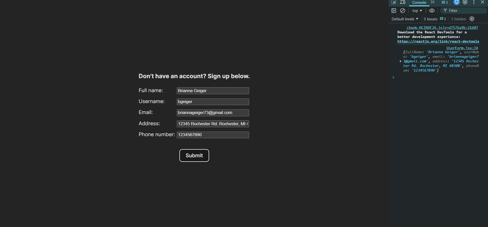

# User Sign Up Example
---
This is a basic example of a sign-up form for a website. This project was created with: 
- ReactJS
- HTML
- CSS

The form asks a user for their full name, username, email address, home address, and phone number.

---
The website has basic functionality, so when the user puts in their information and submits the form, their information will only be displayed in the console.

